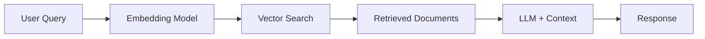

## Introduction

Retrieval-Augmented Generation (RAG) has become the go-to pattern for building AI applications that need access to custom knowledge bases. In this post, we'll build a production-ready RAG system from scratch.

> This is a technical template post demonstrating Chirpy's features. Replace the content with your actual tutorial!
{: .prompt-info }

## What is RAG?

RAG combines the power of large language models with external knowledge retrieval. Instead of relying solely on the LLM's training data, RAG:

1. **Retrieves** relevant documents from a knowledge base
2. **Augments** the prompt with this context
3. **Generates** a response grounded in the retrieved information



## Prerequisites

Before we start, ensure you have:

- Python 3.9+
- OpenAI API key (or another LLM provider)
- Basic understanding of embeddings and vector databases

```bash
pip install langchain langchain-openai chromadb tiktoken
```

## Project Structure

```
rag-system/
├── src/
│   ├── __init__.py
│   ├── embeddings.py
│   ├── retriever.py
│   ├── chain.py
│   └── main.py
├── data/
│   └── documents/
├── tests/
│   └── test_retriever.py
├── .env
└── requirements.txt
```

## Step 1: Document Loading and Chunking

The first step is loading and chunking your documents:

```python
from langchain.document_loaders import DirectoryLoader, TextLoader
from langchain.text_splitter import RecursiveCharacterTextSplitter

def load_documents(directory: str) -> list:
    """Load documents from a directory."""
    loader = DirectoryLoader(
        directory,
        glob="**/*.txt",
        loader_cls=TextLoader
    )
    documents = loader.load()

    # Chunk documents for better retrieval
    text_splitter = RecursiveCharacterTextSplitter(
        chunk_size=1000,
        chunk_overlap=200,
        separators=["\n\n", "\n", " ", ""]
    )

    chunks = text_splitter.split_documents(documents)
    return chunks
```

> **Pro Tip:** Chunk size significantly impacts retrieval quality. Smaller chunks (500-1000 tokens) often work better for specific queries, while larger chunks preserve more context.
{: .prompt-tip }

## Step 2: Creating the Vector Store

```python
from langchain_openai import OpenAIEmbeddings
from langchain.vectorstores import Chroma

def create_vector_store(documents: list, persist_directory: str) -> Chroma:
    """Create and persist a vector store."""
    embeddings = OpenAIEmbeddings(model="text-embedding-3-small")

    vector_store = Chroma.from_documents(
        documents=documents,
        embedding=embeddings,
        persist_directory=persist_directory
    )

    return vector_store
```

## Step 3: Building the RAG Chain

```python
from langchain_openai import ChatOpenAI
from langchain.prompts import ChatPromptTemplate
from langchain.schema.runnable import RunnablePassthrough
from langchain.schema.output_parser import StrOutputParser

def create_rag_chain(retriever):
    """Create a RAG chain with the given retriever."""

    template = """Answer the question based on the following context.
    If you cannot answer from the context, say so.

    Context:
    {context}

    Question: {question}

    Answer:"""

    prompt = ChatPromptTemplate.from_template(template)
    llm = ChatOpenAI(model="gpt-4", temperature=0)

    chain = (
        {"context": retriever, "question": RunnablePassthrough()}
        | prompt
        | llm
        | StrOutputParser()
    )

    return chain
```

## Step 4: Putting It All Together

```python
def main():
    # Load and process documents
    documents = load_documents("./data/documents")

    # Create vector store
    vector_store = create_vector_store(documents, "./chroma_db")

    # Create retriever with search parameters
    retriever = vector_store.as_retriever(
        search_type="similarity",
        search_kwargs={"k": 4}
    )

    # Create RAG chain
    chain = create_rag_chain(retriever)

    # Query the system
    response = chain.invoke("What is the main topic of the documents?")
    print(response)

if __name__ == "__main__":
    main()
```

## Advanced: Hybrid Search

For better results, combine semantic and keyword search:

```python
from langchain.retrievers import BM25Retriever, EnsembleRetriever

def create_hybrid_retriever(documents, vector_store):
    """Create a hybrid retriever combining BM25 and vector search."""

    # Keyword-based retriever
    bm25_retriever = BM25Retriever.from_documents(documents)
    bm25_retriever.k = 4

    # Vector-based retriever
    vector_retriever = vector_store.as_retriever(search_kwargs={"k": 4})

    # Combine with weighted ensemble
    ensemble_retriever = EnsembleRetriever(
        retrievers=[bm25_retriever, vector_retriever],
        weights=[0.3, 0.7]  # Favor semantic search
    )

    return ensemble_retriever
```

## Performance Considerations

| Approach | Latency | Accuracy | Cost |
|----------|---------|----------|------|
| Simple RAG | Low | Medium | $ |
| Hybrid Search | Medium | High | $$ |
| Reranking | High | Very High | $$$ |

## Common Pitfalls

> **Warning:** Avoid these common mistakes when building RAG systems:
{: .prompt-warning }

1. **Chunks too large** — Retrieved context may contain irrelevant information
2. **No overlap** — Important context split across chunk boundaries
3. **Poor prompting** — Not instructing the LLM to use the context properly
4. **Ignoring metadata** — Useful for filtering and attribution

## Next Steps

In future posts, we'll cover:

- [ ] Adding reranking with Cohere or cross-encoders
- [ ] Implementing conversation memory
- [ ] Evaluating RAG performance with RAGAS
- [ ] Deploying with FastAPI

## Resources

- [LangChain Documentation](https://python.langchain.com/)
- [Chroma Vector Database](https://www.trychroma.com/)
- [OpenAI Embeddings Guide](https://platform.openai.com/docs/guides/embeddings)

---

*Have questions or suggestions? Reach out on [Twitter](https://twitter.com/willburnstech) or leave a comment below!*
