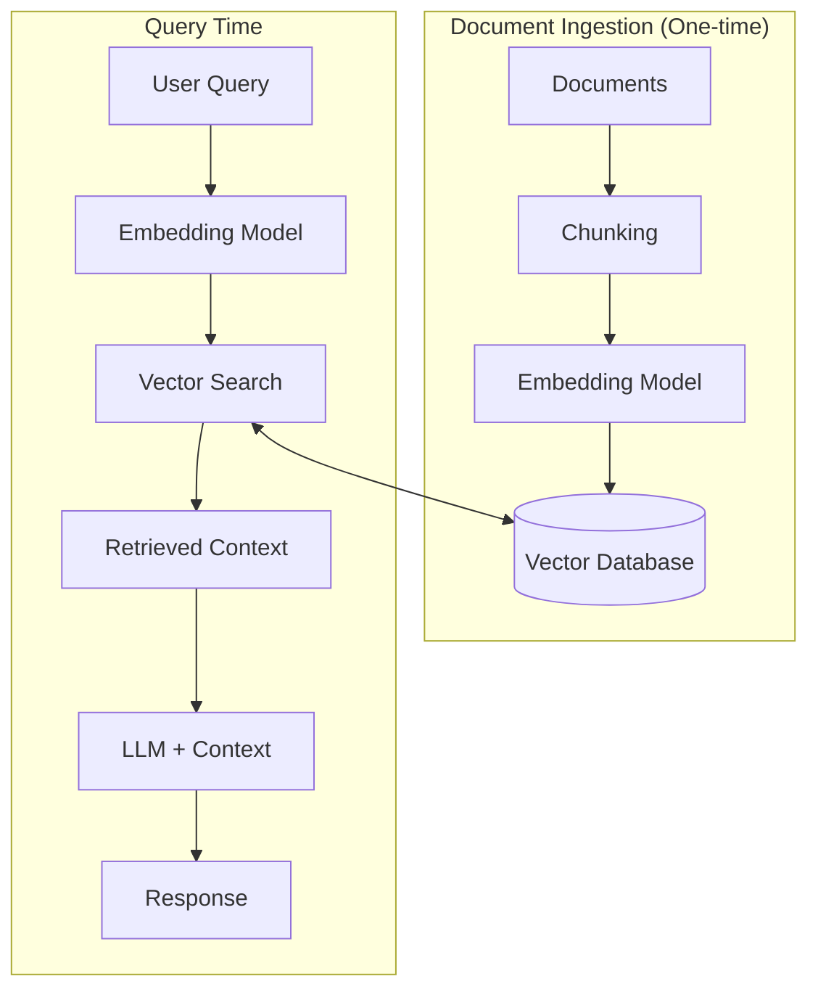

## Introduction

If you've ever asked an LLM a question about recent events or your own data and watched it confidently make something up, you've experienced the core problem that RAG solves. Large language models are impressive, but they're frozen in time and have no idea what's in your documents, your codebase, or your company's knowledge base.

That's where Retrieval-Augmented Generation comes in. I've spent a good amount of time building RAG systems, and I can tell you - once you understand the architecture and make the right choices early on, everything clicks into place. In this post, I'll walk you through building a RAG AI agent with LangChain, sharing what I've learned along the way.

## Understanding RAG Architecture

Before diving into code, let's look at what we're actually building. RAG isn't magic - it's a pattern that gives your LLM access to external knowledge at query time.

Here's the high-level flow:



The architecture breaks down into two main phases:

**Ingestion Phase** - This happens once (or whenever your documents update). You take your documents, split them into chunks, convert those chunks into vector embeddings, and store them in a vector database.

**Query Phase** - When a user asks a question, you embed that question using the same model, search your vector database for similar chunks, then pass those chunks as context to your LLM along with the original question.

The beauty of this approach is that your LLM now has access to your specific data without needing to fine-tune anything. The retrieved context grounds the response in actual information rather than the model's training data.

## Choosing Your Vector Database

This is one of the first decisions you'll need to make, and it matters more than you might think. There are several solid options out there:

- **Pinecone** - Fully managed, scales effortlessly, great developer experience
- **Chroma** - Open source, easy to get started, good for prototyping
- **Weaviate** - Open source with hybrid search capabilities
- **Qdrant** - Open source, performant, good filtering options
- **PostgreSQL with pgvector** - If you're already running Postgres

What it really comes down to is this: **managed vs self-hosted**, **scale requirements**, and **your existing infrastructure**.

I've used Pinecone for most of my production RAG systems, and here's why - I don't want to manage infrastructure for vector search. Pinecone handles the scaling, the indexing optimisations, and the availability. When you're building an AI agent, you want to focus on the agent logic, not on keeping a database running.

That said, if you're prototyping or cost-conscious, Chroma is fantastic for local development. I often start with Chroma locally, then migrate to Pinecone when moving to production.

```python
# Pinecone setup example
from pinecone import Pinecone
from langchain_pinecone import PineconeVectorStore

pc = Pinecone(api_key="your-api-key")

# Create or connect to an index
index = pc.Index("rag-agent")

vector_store = PineconeVectorStore(
    index=index,
    embedding=embeddings,
    text_key="text"
)
```

## Choosing Your Embedding Model

Your embedding model is what converts text into vectors - and the quality of your embeddings directly impacts retrieval quality. Get this wrong, and your agent will retrieve irrelevant context no matter how good your LLM is.

Here are the main options I've worked with:

**OpenAI Embeddings**
- `text-embedding-3-small` - Good balance of cost and performance
- `text-embedding-3-large` - Higher quality, higher cost
- Easy to use, reliable, but you're paying per token

**Open Source Alternatives**
- Sentence Transformers (all-MiniLM-L6-v2, etc.) - Free, run locally
- Cohere Embed - Good quality, competitive pricing
- Voyage AI - Designed specifically for retrieval

What should you consider?

1. **Dimensions** - Higher dimensions can capture more nuance but use more storage
2. **Performance** - How well does it actually retrieve relevant documents?
3. **Cost** - OpenAI charges per token, open source is free but needs compute
4. **Latency** - Local models are faster, API calls add network overhead

For most use cases, I start with OpenAI's `text-embedding-3-small`. It's 1536 dimensions, performs well, and the cost is reasonable. If I need to optimise costs or run offline, I'll look at sentence transformers.

```python
from langchain_openai import OpenAIEmbeddings

# OpenAI embeddings
embeddings = OpenAIEmbeddings(model="text-embedding-3-small")

# Or using sentence transformers (free, local)
from langchain_huggingface import HuggingFaceEmbeddings

embeddings = HuggingFaceEmbeddings(
    model_name="sentence-transformers/all-MiniLM-L6-v2"
)
```

## Building the RAG Agent with LangChain

Now let's put it all together. I'll walk through each component as we build out the agent.

### Document Loading and Chunking

First, we need to load documents and split them into chunks. Chunking strategy matters - too large and you'll retrieve irrelevant content, too small and you'll lose context.

```python
from langchain_community.document_loaders import DirectoryLoader, TextLoader
from langchain.text_splitter import RecursiveCharacterTextSplitter

def load_and_chunk_documents(directory: str):
    """Load documents and split into chunks for embedding."""

    loader = DirectoryLoader(
        directory,
        glob="**/*.txt",
        loader_cls=TextLoader
    )
    documents = loader.load()

    # RecursiveCharacterTextSplitter is my go-to
    # It tries to split on natural boundaries
    text_splitter = RecursiveCharacterTextSplitter(
        chunk_size=1000,
        chunk_overlap=200,  # Overlap helps preserve context at boundaries
        separators=["\n\n", "\n", ". ", " ", ""]
    )

    chunks = text_splitter.split_documents(documents)
    print(f"Split {len(documents)} documents into {len(chunks)} chunks")

    return chunks
```

I typically use chunk sizes between 500-1000 characters with 10-20% overlap. The overlap is important - it ensures that if a relevant piece of information gets split across chunks, you'll still have context on both sides.

### Setting Up the Vector Store

With Pinecone, setting up your vector store looks like this:

```python
from pinecone import Pinecone, ServerlessSpec
from langchain_pinecone import PineconeVectorStore
from langchain_openai import OpenAIEmbeddings

def setup_vector_store(chunks, index_name: str):
    """Create embeddings and store in Pinecone."""

    # Initialise Pinecone
    pc = Pinecone(api_key=os.environ["PINECONE_API_KEY"])

    # Create index if it doesn't exist
    if index_name not in pc.list_indexes().names():
        pc.create_index(
            name=index_name,
            dimension=1536,  # Matches text-embedding-3-small
            metric="cosine",
            spec=ServerlessSpec(cloud="aws", region="us-east-1")
        )

    embeddings = OpenAIEmbeddings(model="text-embedding-3-small")

    # Create vector store from documents
    vector_store = PineconeVectorStore.from_documents(
        documents=chunks,
        embedding=embeddings,
        index_name=index_name
    )

    return vector_store
```

### Creating the RAG Chain

Here's where the retrieval and generation come together:

```python
from langchain_openai import ChatOpenAI
from langchain.prompts import ChatPromptTemplate
from langchain_core.runnables import RunnablePassthrough
from langchain_core.output_parsers import StrOutputParser

def create_rag_chain(vector_store):
    """Build the RAG chain that retrieves context and generates responses."""

    # Create retriever from vector store
    retriever = vector_store.as_retriever(
        search_type="similarity",
        search_kwargs={"k": 4}  # Retrieve top 4 chunks
    )

    # The prompt template - this is crucial
    template = """You are a helpful assistant. Answer the user's question based on the context provided below.

If the context doesn't contain enough information to answer the question, say so honestly rather than making something up.

Context:
{context}

Question: {question}

Answer:"""

    prompt = ChatPromptTemplate.from_template(template)

    llm = ChatOpenAI(model="gpt-4", temperature=0)

    # Build the chain using LCEL
    chain = (
        {"context": retriever, "question": RunnablePassthrough()}
        | prompt
        | llm
        | StrOutputParser()
    )

    return chain
```

### Putting It All Together

Here's the complete flow:

```python
import os
from dotenv import load_dotenv

load_dotenv()

def main():
    # Load and chunk your documents
    chunks = load_and_chunk_documents("./data/documents")

    # Set up vector store (this embeds and stores everything)
    vector_store = setup_vector_store(chunks, "rag-agent-index")

    # Create the RAG chain
    chain = create_rag_chain(vector_store)

    # Now you can query
    response = chain.invoke("What are the main features of the product?")
    print(response)

if __name__ == "__main__":
    main()
```

## Lessons Learned

After building several of these systems, here are the things I wish I'd known from the start:

**Chunking is more important than you think.** I've seen systems fail simply because the chunk size was wrong for the use case. Experiment with different sizes and measure retrieval quality.

**Embeddings need to match.** This sounds obvious, but make sure you're using the same embedding model for ingestion and querying. I've debugged systems where someone switched models and wondered why retrieval stopped working.

**Metadata is your friend.** Don't just store the text - store source, date, category, whatever is relevant. You can filter on metadata during retrieval, which is incredibly powerful.

**Test your retrieval separately.** Before you worry about the LLM's responses, make sure the right documents are being retrieved. If retrieval is broken, no amount of prompt engineering will save you.

**Start simple, then optimise.** Basic RAG with good chunking often beats complex hybrid search done poorly. Get the fundamentals right first.

## Wrapping Up

Building a RAG AI agent isn't as complicated as it might seem at first. The key is understanding the architecture, making informed decisions about your vector database and embedding model, and then iterating on your chunking and prompts.

If you're just getting started, I'd recommend:
1. Start with Chroma locally and OpenAI embeddings
2. Get a basic pipeline working end-to-end
3. Test retrieval quality before worrying about the LLM
4. Move to a managed solution like Pinecone when you're ready for production

From there, you can explore advanced techniques like hybrid search, reranking, and conversation memory. But the foundation we've covered here will take you surprisingly far.

## Resources

- [LangChain Documentation](https://python.langchain.com/)
- [Pinecone Documentation](https://docs.pinecone.io/)
- [OpenAI Embeddings Guide](https://platform.openai.com/docs/guides/embeddings)

---

*Have questions about building RAG systems? Feel free to reach out - I'm always happy to chat about AI architecture.*
